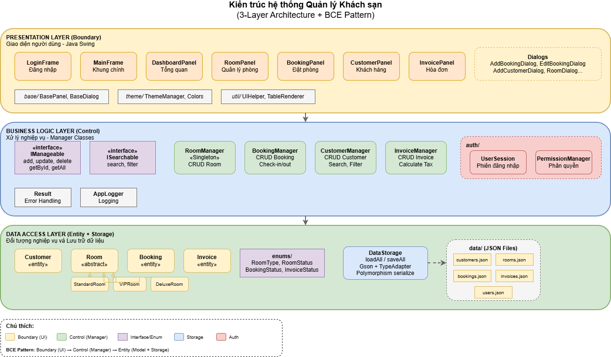

# 🏨 Hệ thống Quản lý Khách sạn (Hotel Management System)

## 📋 Mô tả
Đồ án môn học **Lập trình Hướng đối tượng (OOP)** - Hệ thống quản lý khách sạn với đầy đủ các chức năng quản lý phòng, đặt phòng, khách hàng, hóa đơn và báo cáo.

## 👥 Thành viên nhóm
| Thành viên | Nhiệm vụ | Trạng thái |
|------------|----------|------------|
| Thành viên 1 | Quản lý Phòng (Room), Interfaces, Storage | ✅ Hoàn thành |
| Thành viên 2 | Quản lý Đặt phòng, Khách hàng, Hóa đơn, UI | ✅ Hoàn thành |

---

## 🏗️ Kiến trúc hệ thống

### BCE Pattern (Boundary-Control-Entity)

```
┌─────────────────────────────────────────────────────────────────┐
│  PRESENTATION LAYER (Boundary) - Java Swing                     │
│  LoginFrame, MainFrame, BookingPanel, CustomerPanel, RoomPanel  │
└─────────────────────────────────────────────────────────────────┘
                              ↓
┌─────────────────────────────────────────────────────────────────┐
│  BUSINESS LOGIC LAYER (Control) - Manager Classes               │
│  BookingManager, CustomerManager, RoomManager, InvoiceManager   │
│  + Interfaces: IManageable<T>, ISearchable<T>                   │
└─────────────────────────────────────────────────────────────────┘
                              ↓
┌─────────────────────────────────────────────────────────────────┐
│  DATA ACCESS LAYER (Entity + Storage)                           │
│  Customer, Room (abstract), Booking, Invoice                    │
│  DataStorage (JSON với Gson + TypeAdapter)                      │
└─────────────────────────────────────────────────────────────────┘
```



---

## 🛠️ Công nghệ sử dụng

| Công nghệ | Phiên bản | Mục đích |
|-----------|-----------|----------|
| Java | 21+ | Ngôn ngữ lập trình |
| Java Swing | - | UI Framework |
| FlatLaf | 3.x | Modern Look & Feel |
| Gson | 2.10+ | JSON Serialization |
| Maven | 3.6+ | Build Tool |
| JUnit | 5 | Unit Testing |

---

## 📐 Cấu trúc dự án

```
OOPproject/
├── src/com/hotel/
│   ├── Main.java                    # Entry point
│   ├── auth/                        # Authentication & Authorization
│   │   ├── PermissionManager.java   # Phân quyền (MANAGER, STAFF, SERVICE)
│   │   └── UserSession.java         # Quản lý phiên đăng nhập
│   ├── model/                       # Entity Layer
│   │   ├── room/                    # Phòng (Inheritance + Polymorphism)
│   │   │   ├── Room.java            # Abstract class
│   │   │   ├── StandardRoom.java    # Phòng tiêu chuẩn
│   │   │   ├── VIPRoom.java         # Phòng VIP
│   │   │   └── DeluxeRoom.java      # Phòng Deluxe
│   │   ├── customer/Customer.java   # Khách hàng
│   │   ├── booking/Booking.java     # Đặt phòng (Information Expert)
│   │   ├── invoice/Invoice.java     # Hóa đơn (Self-calculating)
│   │   └── enums/                   # Enums
│   │       ├── RoomType.java
│   │       ├── RoomStatus.java
│   │       └── BookingStatus.java
│   ├── service/                     # Control Layer
│   │   ├── RoomManager.java         # Singleton Pattern
│   │   ├── CustomerManager.java
│   │   ├── BookingManager.java
│   │   ├── InvoiceManager.java
│   │   └── interfaces/              # Abstraction
│   │       ├── IManageable.java     # Generic CRUD interface
│   │       ├── ISearchable.java     # Search & Filter interface
│   │       └── IStorable.java       # Storage interface
│   ├── storage/
│   │   └── DataStorage.java         # JSON persistence (Gson + TypeAdapter)
│   ├── ui/                          # Boundary Layer
│   │   ├── LoginFrame.java
│   │   ├── MainFrame.java
│   │   ├── DashboardPanel.java
│   │   ├── RoomPanel.java
│   │   ├── BookingPanel.java
│   │   ├── CustomerPanel.java
│   │   ├── InvoicePanel.java
│   │   ├── base/                    # Base UI classes
│   │   ├── theme/                   # Theme management
│   │   └── util/                    # UI utilities
│   └── util/
│       ├── AppLogger.java           # Logging
│       └── Result.java              # Error handling
├── data/                            # JSON data files
│   ├── rooms.json
│   ├── customers.json
│   ├── bookings.json
│   ├── invoices.json
│   └── users.json
├── docs/                            # Documentation
│   └── diagrams/                    # UML Diagrams (draw.io)
├── test/                            # Unit tests
└── pom.xml                          # Maven configuration
```

---

## 🎯 Các nguyên lý OOP được áp dụng

### 4 Tính chất OOP

| Tính chất | Minh chứng |
|-----------|------------|
| **Encapsulation** | Thuộc tính `private`, getter/setter với validation |
| **Inheritance** | `Room` (abstract) → `StandardRoom`, `VIPRoom`, `DeluxeRoom` |
| **Polymorphism** | `room.calculatePrice()` override khác nhau mỗi lớp con |
| **Abstraction** | Abstract class `Room`, interfaces `IManageable<T>`, `ISearchable<T>` |

### GRASP Principles

| Nguyên lý | Áp dụng |
|-----------|---------|
| **Information Expert** | `Booking.calculateTotalPrice()`, `Invoice.calculateAmounts()` |
| **Creator** | `BookingManager` tạo `Booking`, `InvoiceManager` tạo `Invoice` |
| **Controller** | Các Manager classes điều phối nghiệp vụ |
| **Low Coupling** | Sử dụng interfaces (`IManageable`, `ISearchable`) |
| **High Cohesion** | Mỗi class có trách nhiệm rõ ràng |

### Design Patterns

| Pattern | Vị trí |
|---------|--------|
| **Singleton** | `RoomManager.getInstance()` |
| **Factory** | `RoomTypeAdapter` trong DataStorage |
| **Template Method** | Abstract `Room.calculatePrice()` |

---

## 👥 Hệ thống phân quyền (3 Actors)

| Vai trò | Mã | Quyền hạn |
|---------|-----|-----------|
| **Quản lý** | MANAGER | Quản lý phòng (CRUD), xem báo cáo doanh thu |
| **Lễ tân** | STAFF | Đặt phòng, Check-in/out, Quản lý khách hàng, Lập hóa đơn |
| **Dịch vụ** | SERVICE | Xem trạng thái phòng, Hỗ trợ khách hàng |

---

## 📊 Loại phòng

| Loại | Giá cơ bản | Hệ số nhân | Tiện nghi đặc biệt |
|------|-----------|------------|-------------------|
| **Standard** | 500,000 VND | x1.0 | Cơ bản |
| **VIP** | 1,000,000 VND | x1.2 | View, Phòng tắm riêng |
| **Deluxe** | 1,500,000 VND | x1.5 | Jacuzzi, Minibar, Phòng khách |

---

## 🚀 Hướng dẫn chạy

### Yêu cầu
- Java JDK 21+
- Maven 3.6+

### Cài đặt và chạy

```bash
# Clone repository
git clone <repository-url>
cd OOPproject

# Cài đặt dependencies
mvn clean install

# Chạy ứng dụng
mvn exec:java -Dexec.mainClass="com.hotel.Main"
```

Hoặc chạy trực tiếp từ IDE (IntelliJ IDEA, VS Code, Eclipse).

### Chạy tests

```bash
mvn test
```

### Tài khoản đăng nhập mẫu

| Username | Password | Vai trò |
|----------|----------|---------|
| admin | admin123 | MANAGER |
| staff | staff123 | STAFF |
| service | service123 | SERVICE |

---

## 📚 Tài liệu

### Báo cáo LaTeX
- `Chương 1_ Khảo sát hệ thống.tex`
- `Chương 2_ Đặc tả yêu cầu.tex`
- `Chương 3_ Thiết kế hệ thống.tex`
- `Chương 4_ Thiết kế giao diện.tex`
- `Chương 5_ Kiểm thử.tex`
- `Chương 6_ Bảo trì phần mềm.tex`

### UML Diagrams (`docs/diagrams/`)
- **Use Case:** UseCaseTongQuan, QuanLy, LeTan, DichVu
- **Sequence:** DangNhap, DatPhong, CheckIn, CheckOut, ThemPhong, SuaPhong, XoaPhong, XemPhong, ThemKhachHang, SuaKhachHang, XoaKhachHang
- **Class:** ClassTongQuan, EntityClass, RoomClass, InterfacesClass

---

## ✅ Tính năng

### Quản lý Phòng (MANAGER)
- [x] Thêm/Sửa/Xóa phòng (3 loại: Standard, VIP, Deluxe)
- [x] Xem danh sách phòng với Polymorphism (`calculatePrice()`)
- [x] Lọc theo loại phòng, trạng thái
- [x] Thống kê công suất

### Quản lý Đặt phòng (STAFF)
- [x] Tạo đặt phòng mới (tự động tính giá)
- [x] Check-in / Check-out
- [x] Sửa/Hủy đặt phòng
- [x] Kiểm tra phòng trống theo ngày

### Quản lý Khách hàng (STAFF)
- [x] Thêm/Sửa/Xóa khách hàng
- [x] Tìm kiếm theo tên, email, SĐT
- [x] Hệ thống khách VIP và điểm tích lũy

### Quản lý Hóa đơn (STAFF)
- [x] Tạo hóa đơn từ Booking (tự động tính thuế 10%)
- [x] Thanh toán hóa đơn
- [x] Báo cáo doanh thu

### Dashboard & Báo cáo (MANAGER)
- [x] Tổng quan: Số phòng, Booking, Doanh thu
- [x] Báo cáo doanh thu theo tháng

---

## 🔗 Quick APIs

```java
// Room Management (Singleton + Polymorphism)
RoomManager.getInstance().add(new VIPRoom(...));
room.calculatePrice(days);  // Đa hình

// Booking Management (Information Expert)
BookingManager.add(booking);
booking.calculateTotalPrice();  // Entity tự tính

// Invoice Management (Self-calculating)
InvoiceManager.createFromBooking(booking, taxRate);
invoice.calculateAmounts();  // Tự tính thuế

// Data Persistence (JSON + Gson TypeAdapter)
DataStorage.loadAllData();
DataStorage.saveAllData();
```

---

## 📝 License

MIT License - OOP Project 2025
