# BÁO CÁO ĐỒ ÁN
# HỆ THỐNG QUẢN LÝ KHÁCH SẠN (Hotel Management System)

**Môn học:** Lập trình Hướng đối tượng  
**Ngày hoàn thành:** 04/01/2026

---

## MỤC LỤC

1. [Giới thiệu](#chương-1-giới-thiệu)
2. [Phân tích yêu cầu](#chương-2-phân-tích-yêu-cầu)
3. [Thiết kế hệ thống](#chương-3-thiết-kế-hệ-thống)
4. [Thiết kế chi tiết](#chương-4-thiết-kế-chi-tiết)
5. [Tổ chức mã nguồn](#chương-5-tổ-chức-mã-nguồn)
6. [Hướng dẫn sử dụng](#chương-6-hướng-dẫn-sử-dụng)

---

# CHƯƠNG 1: GIỚI THIỆU

## 1.1 Bối cảnh và bài toán

Trong ngành dịch vụ khách sạn hiện đại, việc quản lý thông tin phòng, đặt phòng, khách hàng và hóa đơn đòi hỏi một hệ thống phần mềm hiệu quả. Các khách sạn cần:

- **Quản lý phòng**: Theo dõi trạng thái phòng (trống, đang sử dụng, bảo trì), loại phòng và giá
- **Quản lý đặt phòng**: Xử lý booking, kiểm tra phòng trống, tránh đặt trùng
- **Quản lý khách hàng**: Lưu trữ thông tin, theo dõi loyalty points
- **Quản lý hóa đơn**: Tính toán chi phí, thuế, theo dõi thanh toán

## 1.2 Mục tiêu dự án

| Mục tiêu | Mô tả |
|----------|-------|
| **Chức năng** | Xây dựng hệ thống quản lý khách sạn hoàn chỉnh với CRUD cho Room, Booking, Customer, Invoice |
| **Kỹ thuật** | Áp dụng đầy đủ 4 tính chất OOP: Encapsulation, Inheritance, Polymorphism, Abstraction |
| **Công nghệ** | Sử dụng Java Swing UI, JSON storage, Maven build |

## 1.3 Phạm vi hệ thống

```
┌────────────────────────────────────────────────────────────┐
│                  Hệ thống Quản lý Khách sạn                │
├────────────────────────────────────────────────────────────┤
│  ┌─────────────┐ ┌─────────────┐ ┌─────────────────────┐   │
│  │ Quản lý     │ │ Quản lý     │ │ Quản lý             │   │
│  │ Phòng       │ │ Đặt phòng   │ │ Khách hàng          │   │
│  └─────────────┘ └─────────────┘ └─────────────────────┘   │
│  ┌─────────────┐ ┌─────────────┐ ┌─────────────────────┐   │
│  │ Quản lý     │ │ Đăng nhập/  │ │ Báo cáo             │   │
│  │ Hóa đơn     │ │ Phân quyền  │ │ Thống kê            │   │
│  └─────────────┘ └─────────────┘ └─────────────────────┘   │
└────────────────────────────────────────────────────────────┘
```

## 1.4 Công nghệ sử dụng

| Thành phần | Công nghệ |
|------------|-----------|
| Ngôn ngữ | Java 21 |
| UI Framework | Java Swing + FlatLaf |
| Data Storage | JSON (Gson library) |
| Build Tool | Maven |
| Testing | JUnit 5 |

## 1.5 Phân công nhóm

| Thành viên | Nhiệm vụ |
|------------|----------|
| Thành viên 1 | Quản lý Phòng, Menu chính, Storage, Login, RoomFactory |
| Thành viên 2 | Quản lý Đặt phòng, Khách hàng, Hóa đơn, DataStorage |

---

# CHƯƠNG 2: PHÂN TÍCH YÊU CẦU

## 2.1 Đặc tả Actor (Tác nhân)

### 2.1.1 Danh sách Actor

Hệ thống sử dụng 3 Role nghiệp vụ chính được định nghĩa trong `PermissionManager.Role`:

| Actor | Role trong code | Mô tả | Chức năng chính |
|-------|-----------------|-------|-----------------|
| **Quản lý (Manager)** | `MANAGER` | Quản lý khách sạn | Quản lý phòng, xem báo cáo doanh thu |
| **Lễ tân (Staff)** | `STAFF` | Nhân viên tiếp tân | Đặt phòng, check-in, check-out, quản lý khách hàng |
| **Bộ phận Dịch vụ (Service)** | `SERVICE` | Nhân viên dịch vụ | Cung cấp dịch vụ, hỗ trợ khách hàng |

> **Lưu ý:** Role `ADMIN` (Quản trị viên) có full quyền nhưng không được thể hiện trong sơ đồ Use Case vì không phải Actor nghiệp vụ điển hình.

### 2.1.2 Mô tả chi tiết Actor

**Quản lý (Manager):**
- Quản lý thêm/sửa/xóa phòng
- Xem báo cáo doanh thu, thống kê

**Lễ tân (Staff):**
- Là actor chính sử dụng hệ thống nhiều nhất
- Thực hiện các nghiệp vụ: đặt phòng, nhận phòng, trả phòng, tạo hóa đơn
- Xem thông tin phòng và khách hàng

**Bộ phận Dịch vụ (Service):**
- Cung cấp dịch vụ cho khách hàng
- Xem thông tin phòng và dịch vụ

## 2.2 Use Case tổng quan hệ thống

### 2.2.1 Sơ đồ Use Case tổng quan (Chuẩn UML)


> **Giải thích:**
> - `---` : Liên kết (Association) giữa Actor và Use Case
> - Sơ đồ thể hiện 3 Actor nghiệp vụ chính theo `PermissionManager.Role`
> - Mỗi Actor nối trực tiếp tới "Đăng nhập"

### 2.2.2 Usecase dành cho tác nhân "Lễ tân" (Staff)


> **Giải thích quan hệ <<include>>:**
> - "Đặt phòng mới" **bắt buộc phải** "Tìm phòng trống" trước → dùng `<<include>>`
> - "Check-out" **bắt buộc phải** "Tạo hóa đơn" → dùng `<<include>>`

### 2.2.3 Usecase dành cho tác nhân "Quản lý" (Manager)


### 2.2.4 Usecase dành cho tác nhân "Bộ phận Dịch vụ" (Service)


> **Lưu ý quan trọng về Use Case Diagram:**
> 1. **Không sử dụng kế thừa Actor** - Hệ thống dùng Role enum độc lập
> 2. **Quan hệ <<include>>** - Use Case A **bắt buộc** phải thực hiện Use Case B
> 3. **Quan hệ <<extend>>** - Use Case B là **tùy chọn** mở rộng của Use Case A


## 2.3 Đặc tả các Usecase và hiện thực hoá

### Usecase "Đăng nhập"

| Trường | Nội dung |
|--------|----------|
| **Use Case** | Đăng nhập |
| **Tác nhân** | Nhân viên (Actor cha - tất cả Actor con đều kế thừa) |
| **Mô tả UC** | Cho phép người dùng đăng nhập để vào hệ thống |
| **Tiền điều kiện** | Người dùng chưa đăng nhập |
| **Luồng sự kiện** | 1). Hệ thống hiện form đăng nhập và yêu cầu nhập tài khoản và mật khẩu.<br>2). Người dùng nhập tài khoản và mật khẩu của mình và nhấn nút đăng nhập.<br>3). Hệ thống sẽ kiểm tra tài khoản.<br>4). Hệ thống thông báo đăng nhập thành công và cho actor vào hệ thống và phân quyền theo vai trò. |
| **Luồng sự kiện phụ** | 3.1). Tên tài khoản hoặc mật khẩu không đúng, hệ thống báo tài khoản không hợp lệ và yêu cầu nhập lại. |

**Bảng 2.1: Đặc tả Usecase "Đăng nhập"**

---

### Usecase "Quản lý Phòng"

| Trường | Nội dung |
|--------|----------|
| **Use Case** | Quản lý Phòng |
| **Tác nhân** | Quản lý |
| **Mô tả UC** | Cho phép quản lý thêm, sửa, xóa thông tin phòng |
| **Tiền điều kiện** | Người dùng đã đăng nhập với quyền Quản lý |
| **Luồng sự kiện** | 1). Quản lý chọn menu "Quản lý Phòng".<br>2). Hệ thống hiển thị danh sách phòng hiện có.<br>3). Quản lý chọn thao tác: Thêm/Sửa/Xóa phòng.<br>4). Hệ thống hiển thị form tương ứng.<br>5). Quản lý nhập thông tin và xác nhận.<br>6). Hệ thống lưu thay đổi và cập nhật danh sách. |
| **Luồng sự kiện phụ** | 5.1). Thông tin không hợp lệ, hệ thống báo lỗi và yêu cầu nhập lại.<br>5.2). Xóa phòng đang có booking, hệ thống từ chối và thông báo. |

**Bảng 2.2: Đặc tả Usecase "Quản lý Phòng"**

---

### Usecase "Đặt phòng"

| Trường | Nội dung |
|--------|----------|
| **Use Case** | Đặt phòng |
| **Tác nhân** | Lễ tân |
| **Mô tả UC** | Cho phép lễ tân tạo booking mới cho khách hàng |
| **Tiền điều kiện** | Người dùng đã đăng nhập với quyền Lễ tân, có phòng trống |
| **Luồng sự kiện** | 1). Lễ tân chọn menu "Đặt phòng".<br>2). Hệ thống hiển thị form đặt phòng.<br>3). Lễ tân chọn/nhập thông tin khách hàng.<br>4). Lễ tân chọn ngày check-in và check-out.<br>5). Hệ thống hiển thị danh sách phòng trống trong khoảng thời gian đó.<br>6). Lễ tân chọn phòng và xác nhận đặt phòng.<br>7). Hệ thống tính giá và tạo booking với trạng thái PENDING. |
| **Luồng sự kiện phụ** | 5.1). Không có phòng trống, hệ thống thông báo và đề xuất ngày khác.<br>6.1). Khách hàng chưa có trong hệ thống, lễ tân tạo mới khách hàng. |

**Bảng 2.3: Đặc tả Usecase "Đặt phòng"**

---

### Usecase "Check-in"

| Trường | Nội dung |
|--------|----------|
| **Use Case** | Check-in |
| **Tác nhân** | Lễ tân |
| **Mô tả UC** | Cho phép lễ tân nhận phòng cho khách đã đặt trước |
| **Tiền điều kiện** | Có booking với trạng thái CONFIRMED |
| **Luồng sự kiện** | 1). Lễ tân tìm booking theo tên khách hoặc mã booking.<br>2). Hệ thống hiển thị thông tin booking.<br>3). Lễ tân xác nhận thông tin và thực hiện check-in.<br>4). Hệ thống cập nhật trạng thái booking thành CHECKED_IN.<br>5). Hệ thống cập nhật trạng thái phòng thành OCCUPIED. |
| **Luồng sự kiện phụ** | 2.1). Không tìm thấy booking, hệ thống thông báo.<br>3.1). Khách đến sớm/muộn hơn ngày đặt, lễ tân có thể điều chỉnh. |

**Bảng 2.4: Đặc tả Usecase "Check-in"**

---

### Usecase "Check-out và Tạo hóa đơn"

| Trường | Nội dung |
|--------|----------|
| **Use Case** | Check-out và Tạo hóa đơn |
| **Tác nhân** | Lễ tân |
| **Mô tả UC** | Cho phép lễ tân trả phòng và tạo hóa đơn thanh toán |
| **Tiền điều kiện** | Có booking với trạng thái CHECKED_IN |
| **Luồng sự kiện** | 1). Lễ tân tìm booking đang check-in.<br>2). Hệ thống hiển thị thông tin booking và tính toán chi phí.<br>3). Lễ tân xác nhận check-out.<br>4). Hệ thống tạo hóa đơn với subtotal, thuế (10%), và tổng cộng.<br>5). Khách thanh toán, lễ tân đánh dấu hóa đơn là PAID.<br>6). Hệ thống cập nhật trạng thái booking thành COMPLETED.<br>7). Hệ thống cập nhật trạng thái phòng thành AVAILABLE. |
| **Luồng sự kiện phụ** | 5.1). Khách chưa thanh toán, hóa đơn giữ trạng thái ISSUED. |

**Bảng 2.5: Đặc tả Usecase "Check-out và Tạo hóa đơn"**

---

### Usecase "Xem Báo cáo Doanh thu"

| Trường | Nội dung |
|--------|----------|
| **Use Case** | Xem Báo cáo Doanh thu |
| **Tác nhân** | Quản lý |
| **Mô tả UC** | Cho phép quản lý xem thống kê doanh thu |
| **Tiền điều kiện** | Người dùng đã đăng nhập với quyền Quản lý |
| **Luồng sự kiện** | 1). Quản lý chọn menu "Báo cáo".<br>2). Hệ thống hiển thị các loại báo cáo.<br>3). Quản lý chọn xem doanh thu theo tháng/tổng.<br>4). Hệ thống tính toán và hiển thị: tổng doanh thu, doanh thu theo tháng, số hóa đơn đã thanh toán/chưa thanh toán. |
| **Luồng sự kiện phụ** | 4.1). Chưa có dữ liệu, hệ thống hiển thị thông báo trống. |

**Bảng 2.6: Đặc tả Usecase "Xem Báo cáo Doanh thu"**

---

## 2.4 Biểu đồ tuần tự (Sequence Diagram)

### 2.4.1 Biểu đồ tuần tự Usecase "Đăng nhập"


**Hình 2.1: Biểu đồ tuần tự Usecase "Đăng nhập"**

---

### 2.4.2 Biểu đồ tuần tự Usecase "Đặt phòng"


**Hình 2.2: Biểu đồ tuần tự Usecase "Đặt phòng"**

---

### 2.4.3 Biểu đồ tuần tự Usecase "Check-out và Tạo hóa đơn"


**Hình 2.3: Biểu đồ tuần tự Usecase "Check-out và Tạo hóa đơn"**

---

# CHƯƠNG 3: THIẾT KẾ HỆ THỐNG

## 3.1 Kiến trúc MVC

Hệ thống áp dụng mô hình kiến trúc **MVC (Model-View-Controller)**:

```
┌─────────────────────────────────────────────────────────────┐
│                    PRESENTATION LAYER (View)                │
│              (Java Swing - UI Components)                   │
│   MainFrame, LoginFrame, RoomPanel, BookingPanel, etc.     │
├─────────────────────────────────────────────────────────────┤
│                    BUSINESS LAYER (Controller)              │
│                 (Manager Classes)                           │
│     RoomManager, BookingManager, CustomerManager, etc.     │
├─────────────────────────────────────────────────────────────┤
│                     MODEL LAYER (Model)                     │
│                  (Entity Classes)                           │
│   Room, Customer, Booking, Invoice, User, etc.             │
├─────────────────────────────────────────────────────────────┤
│                    DATA LAYER (Storage)                     │
│              (Storage & Persistence)                        │
│        RoomStorage, DataStorage, JSON files                │
└─────────────────────────────────────────────────────────────┘
```

## 3.2 Class Diagram tổng quan

### 3.2.1 Diagram các Interface


### 3.2.2 Diagram lớp Room (Kế thừa)


### 3.2.3 Diagram quan hệ Entity


### 3.2.4 Class Diagram TỔNG THỂ toàn dự án

```mermaid
classDiagram
    %% ==================== INTERFACES ====================
    class IManageable~T~ {
        <<interface>>
        +add(item: T) boolean
        +update(item: T) boolean
        +delete(id: String) boolean
        +getById(id: String) T
        +getAll() List~T~
    }
    
    class ISearchable~T~ {
        <<interface>>
        +search(keyword: String) List~T~
        +filter(criteria: String, value: Object) List~T~
    }
    
    class IStorable~T~ {
        <<interface>>
        +save() void
        +load() List~T~
    }

    %% ==================== ENUMS ====================
    class RoomType {
        <<enumeration>>
        STANDARD
        VIP
        DELUXE
    }
    
    class RoomStatus {
        <<enumeration>>
        AVAILABLE
        OCCUPIED
        MAINTENANCE
        CLEANING
    }
    
    class BookingStatus {
        <<enumeration>>
        PENDING
        CONFIRMED
        CHECKED_IN
        COMPLETED
        CANCELLED
    }
    
    class InvoiceStatus {
        <<enumeration>>
        DRAFT
        ISSUED
        PAID
        CANCELLED
    }

    %% ==================== MODEL LAYER ====================
    class Room {
        <<abstract>>
        #roomId: String
        #floor: int
        #basePrice: double
        #status: RoomStatus
        #description: String
        #bedCount: int
        #area: double
        +calculatePrice(days: int)* double
        +getRoomType()* RoomType
        +getRoomTypeDescription()* String
        +isAvailable() boolean
        +occupy() void
        +release() void
    }
    
    class StandardRoom {
        -PRICE_MULTIPLIER: double = 1.0
        +calculatePrice(days: int) double
        +getRoomType() RoomType
        +getRoomTypeDescription() String
    }
    
    class VIPRoom {
        -PRICE_MULTIPLIER: double = 1.2
        -hasJacuzzi: boolean
        -hasMinibar: boolean
        +calculatePrice(days: int) double
        +getRoomType() RoomType
        +getRoomTypeDescription() String
    }
    
    class DeluxeRoom {
        -PRICE_MULTIPLIER: double = 1.5
        -hasPrivatePool: boolean
        -hasButlerService: boolean
        +calculatePrice(days: int) double
        +getRoomType() RoomType
        +getRoomTypeDescription() String
    }
    
    class Customer {
        -customerId: String
        -fullName: String
        -email: String
        -phoneNumber: String
        -idCard: String
        -address: String
        -registrationDate: LocalDate
        -isVIP: boolean
        -loyaltyPoints: double
        +addLoyaltyPoints(points: double)
    }
    
    class Booking {
        -bookingId: String
        -customer: Customer
        -room: Room
        -checkInDate: LocalDate
        -checkOutDate: LocalDate
        -status: BookingStatus
        -totalPrice: double
        -notes: String
        +calculateTotalPrice() double
        +getNumberOfDays() long
        +isValid() boolean
    }
    
    class Invoice {
        -invoiceId: String
        -booking: Booking
        -invoiceDate: LocalDate
        -subtotal: double
        -taxRate: double
        -taxAmount: double
        -totalAmount: double
        -status: InvoiceStatus
        -notes: String
        +calculateAmounts() void
        +markAsPaid() void
        +markAsIssued() void
        +cancel() void
    }
    
    class RoomFactory {
        <<Factory>>
        +createRoom(type: RoomType, id: String, floor: int, price: double) Room
        +createStandardRoom(id: String, floor: int) Room
        +createVIPRoom(id: String, floor: int) Room
        +createDeluxeRoom(id: String, floor: int) Room
    }

    %% ==================== SERVICE LAYER ====================
    class RoomManager {
        -rooms: List~Room~
        -storage: RoomStorage
        +add(room: Room) boolean
        +update(room: Room) boolean
        +delete(roomId: String) boolean
        +getById(roomId: String) Room
        +getAll() List~Room~
        +findByFloor(floor: int) List~Room~
        +findByType(type: RoomType) List~Room~
        +findAvailableRooms() List~Room~
        +getStatistics() Map
    }
    
    class CustomerManager {
        -customers: List~Customer~
        +add(customer: Customer) boolean
        +update(customer: Customer) boolean
        +delete(customerId: String) boolean
        +getById(customerId: String) Customer
        +getAll() List~Customer~
        +search(keyword: String) List~Customer~
        +filter(criteria: String, value: Object) List~Customer~
        +getTotalCustomers() int
        +getVIPCustomers() int
    }
    
    class BookingManager {
        -bookings: List~Booking~
        -roomManager: RoomManager
        +add(booking: Booking) boolean
        +update(booking: Booking) boolean
        +delete(bookingId: String) boolean
        +getById(bookingId: String) Booking
        +getAll() List~Booking~
        +search(keyword: String) List~Booking~
        +filter(criteria: String, value: Object) List~Booking~
        +isRoomAvailable(room: Room, checkIn: LocalDate, checkOut: LocalDate) boolean
        +getAvailableRooms(checkIn: LocalDate, checkOut: LocalDate) List~Room~
        +getTotalRevenue() double
        +getMonthlyRevenue(month: int, year: int) double
    }
    
    class InvoiceManager {
        -invoices: List~Invoice~
        +add(invoice: Invoice) boolean
        +update(invoice: Invoice) boolean
        +delete(invoiceId: String) boolean
        +getById(invoiceId: String) Invoice
        +getAll() List~Invoice~
        +createInvoiceFromBooking(booking: Booking, invoiceId: String) Invoice
        +markInvoiceAsPaid(invoiceId: String) boolean
        +cancelInvoice(invoiceId: String) boolean
        +getTotalRevenue() double
        +getTotalTax() double
        +getUnpaidRevenue() double
    }

    %% ==================== STORAGE LAYER ====================
    class RoomStorage {
        -ROOMS_FILE: String
        -USERS_FILE: String
        -gson: Gson
        +saveRooms(rooms: List~Room~) boolean
        +loadRooms() List~Room~
        +saveUsers(users: List~User~) boolean
        +loadUsers() List~User~
    }
    
    class DataStorage {
        -CUSTOMERS_FILE: String
        -BOOKINGS_FILE: String
        -INVOICES_FILE: String
        -customerManager: CustomerManager
        -bookingManager: BookingManager
        -invoiceManager: InvoiceManager
        +loadAllData() void
        +saveAllData() void
        +loadCustomers() void
        +saveCustomers() void
        +loadBookings() void
        +saveBookings() void
        +loadInvoices() void
        +saveInvoices() void
    }

    %% ==================== AUTH LAYER ====================
    class UserSession {
        <<Singleton>>
        -instance: UserSession
        -currentUser: User
        -loginTime: LocalDateTime
        +getInstance() UserSession
        +login(user: User) void
        +logout() void
        +getCurrentUser() User
        +isLoggedIn() boolean
    }
    
    class PermissionManager {
        +hasPermission(user: User, action: String) boolean
        +canManageRooms(user: User) boolean
        +canManageBookings(user: User) boolean
        +canViewReports(user: User) boolean
    }

    %% ==================== UI LAYER (chỉ hiện chính) ====================
    class MainFrame {
        -roomPanel: RoomPanel
        -bookingPanel: BookingPanel
        -customerPanel: CustomerPanel
        -invoicePanel: InvoicePanel
        +showPanel(panelName: String) void
    }
    
    class LoginFrame {
        -usernameField: JTextField
        -passwordField: JPasswordField
        +authenticate() boolean
    }

    %% ==================== RELATIONSHIPS ====================
    %% Inheritance
    Room <|-- StandardRoom
    Room <|-- VIPRoom
    Room <|-- DeluxeRoom
    
    %% Implements
    RoomManager ..|> IManageable
    CustomerManager ..|> IManageable
    CustomerManager ..|> ISearchable
    BookingManager ..|> IManageable
    BookingManager ..|> ISearchable
    InvoiceManager ..|> IManageable
    RoomStorage ..|> IStorable
    
    %% Composition
    Booking *-- Customer : contains
    Booking *-- Room : contains
    Invoice *-- Booking : contains
    
    %% Dependencies
    RoomManager --> RoomStorage : uses
    RoomManager --> RoomFactory : uses
    BookingManager --> RoomManager : uses
    DataStorage --> CustomerManager : manages
    DataStorage --> BookingManager : manages
    DataStorage --> InvoiceManager : manages
    MainFrame --> RoomManager : uses
    MainFrame --> BookingManager : uses
    LoginFrame --> UserSession : uses
    LoginFrame --> PermissionManager : uses
    
    %% Enum usage
    Room --> RoomStatus : uses
    Room --> RoomType : uses
    Booking --> BookingStatus : uses
    Invoice --> InvoiceStatus : uses
```



**Hình 3.1: Class Diagram tổng thể Hệ thống Quản lý Khách sạn**

---

### Giải thích Class Diagram tổng thể

| Layer | Classes | Vai trò |
|-------|---------|---------|
| **Interface** | `IManageable<T>`, `ISearchable<T>`, `IStorable<T>` | Định nghĩa hợp đồng cho các class |
| **Enum** | `RoomType`, `RoomStatus`, `BookingStatus`, `InvoiceStatus` | Định nghĩa các trạng thái cố định |
| **Model** | `Room`, `StandardRoom`, `VIPRoom`, `DeluxeRoom`, `Customer`, `Booking`, `Invoice` | Entity classes chứa dữ liệu |
| **Factory** | `RoomFactory` | Tạo các loại Room (Factory Pattern) |
| **Service** | `RoomManager`, `CustomerManager`, `BookingManager`, `InvoiceManager` | Business logic |
| **Storage** | `RoomStorage`, `DataStorage` | Lưu trữ JSON |
| **Auth** | `UserSession`, `PermissionManager` | Xác thực và phân quyền |
| **UI** | `MainFrame`, `LoginFrame`, các Panel | Giao diện người dùng |

---


### Tại sao sử dụng Abstract Class cho Room?

| Lý do | Giải thích |
|-------|------------|
| **Tính đa hình** | Mỗi loại phòng (Standard, VIP, Deluxe) có cách tính giá khác nhau |
| **Tái sử dụng code** | Các thuộc tính chung (roomId, floor, status) được định nghĩa một lần |
| **Mở rộng dễ dàng** | Thêm loại phòng mới chỉ cần extends Room |

### Tại sao sử dụng Composition cho Booking?

- Booking **chứa** Customer và Room (quan hệ "has-a")
- Invoice **chứa** Booking
- Tạo chuỗi liên kết: Customer → Booking → Room → Invoice

### Tại sao sử dụng Interface?

| Interface | Mục đích |
|-----------|----------|
| `IManageable<T>` | Định nghĩa hợp đồng CRUD cho tất cả Manager |
| `ISearchable<T>` | Định nghĩa khả năng tìm kiếm, lọc |
| `IStorable` | Định nghĩa khả năng lưu/tải dữ liệu |

---

# CHƯƠNG 4: THIẾT KẾ CHI TIẾT

## 4.1 Package Structure

```
src/com/hotel/
├── Main.java                 # Entry point
├── auth/                     # Authentication
│   ├── AuthService.java      # Xác thực người dùng
│   └── Permission.java       # Phân quyền
├── model/                    # Entity classes
│   ├── room/
│   │   ├── Room.java         # Abstract class
│   │   ├── StandardRoom.java # Phòng Standard (500,000đ)
│   │   ├── VIPRoom.java      # Phòng VIP (1,000,000đ x 1.2)
│   │   ├── DeluxeRoom.java   # Phòng Deluxe (1,500,000đ x 1.5)
│   │   └── RoomFactory.java  # Factory pattern
│   ├── customer/
│   │   └── Customer.java     # Thông tin khách hàng
│   ├── booking/
│   │   └── Booking.java      # Thông tin đặt phòng
│   ├── invoice/
│   │   └── Invoice.java      # Thông tin hóa đơn
│   └── enums/
│       ├── RoomType.java     # STANDARD, VIP, DELUXE
│       ├── RoomStatus.java   # AVAILABLE, OCCUPIED, MAINTENANCE
│       └── BookingStatus.java# PENDING, CONFIRMED, CHECKED_IN, COMPLETED, CANCELLED
├── service/                  # Business logic (Managers)
│   ├── interfaces/
│   │   ├── IManageable.java
│   │   ├── ISearchable.java
│   │   └── IStorable.java
│   ├── RoomManager.java      # CRUD phòng
│   ├── CustomerManager.java  # CRUD khách hàng
│   ├── BookingManager.java   # CRUD đặt phòng + availability check
│   └── InvoiceManager.java   # CRUD hóa đơn + revenue tracking
├── storage/                  # Data persistence
│   ├── RoomStorage.java      # JSON cho Room
│   └── DataStorage.java      # JSON cho Customer, Booking, Invoice
├── ui/                       # Java Swing UI
│   ├── LoginFrame.java       # Màn hình đăng nhập
│   ├── MainFrame.java        # Frame chính với tabs
│   ├── RoomPanel.java        # Tab quản lý phòng
│   ├── BookingPanel.java     # Tab quản lý đặt phòng
│   ├── CustomerPanel.java    # Tab quản lý khách hàng
│   └── InvoicePanel.java     # Tab quản lý hóa đơn
└── util/                     # Utilities
    ├── Constants.java
    └── Validator.java
```

## 4.2 Mô tả chi tiết các Class

### 4.2.1 Model Layer

| Class | Trách nhiệm | LOC ước tính |
|-------|-------------|--------------|
| `Room` (abstract) | Định nghĩa thuộc tính và phương thức chung cho phòng | ~100 |
| `StandardRoom` | Phòng tiêu chuẩn, giá = basePrice × days | ~50 |
| `VIPRoom` | Phòng VIP, giá = basePrice × days × 1.2 | ~50 |
| `DeluxeRoom` | Phòng cao cấp, giá = basePrice × days × 1.5 | ~50 |
| `Customer` | Quản lý thông tin khách hàng, loyalty points | ~130 |
| `Booking` | Quản lý đặt phòng, tính giá, số ngày | ~160 |
| `Invoice` | Quản lý hóa đơn, tính thuế, trạng thái thanh toán | ~180 |

### 4.2.2 Service Layer (Managers)

| Class | Implements | Chức năng chính |
|-------|------------|-----------------|
| `RoomManager` | `IManageable<Room>` | CRUD phòng, tìm kiếm, sắp xếp |
| `CustomerManager` | `IManageable<Customer>`, `ISearchable<Customer>` | CRUD khách hàng, search, filter |
| `BookingManager` | `IManageable<Booking>`, `ISearchable<Booking>` | CRUD booking, kiểm tra phòng trống, doanh thu |
| `InvoiceManager` | `IManageable<Invoice>` | CRUD hóa đơn, báo cáo doanh thu |

### 4.2.3 Storage Layer

| Class | Chức năng |
|-------|-----------|
| `RoomStorage` | Load/Save rooms.json, users.json |
| `DataStorage` | Load/Save customers.json, bookings.json, invoices.json |

## 4.3 Truy cập và làm việc với Cơ sở dữ liệu

### 4.3.1 Kiến trúc lưu trữ dữ liệu

Hệ thống sử dụng **JSON files** làm cơ sở dữ liệu thay vì RDBMS truyền thống (MySQL, PostgreSQL). Lý do:

| Tiêu chí | JSON Files | RDBMS |
|----------|------------|-------|
| **Độ phức tạp** | Đơn giản, không cần cài đặt server | Cần cài đặt, cấu hình |
| **Phù hợp đồ án** | ✅ Phù hợp quy mô nhỏ | Quá phức tạp |
| **Portable** | File đi kèm project | Cần export/import database |
| **Học tập OOP** | Tập trung vào logic OOP | Phân tán sang SQL |

### 4.3.2 Sơ đồ luồng dữ liệu

```
┌─────────────────────────────────────────────────────────────────┐
│                        UI LAYER                                 │
│   (RoomPanel, BookingPanel, CustomerPanel, InvoicePanel)        │
└─────────────────────────────┬───────────────────────────────────┘
                              │ gọi methods
                              ▼
┌─────────────────────────────────────────────────────────────────┐
│                     SERVICE LAYER                               │
│         (RoomManager, BookingManager, CustomerManager)          │
│                                                                 │
│   - Xử lý business logic                                        │
│   - Validate dữ liệu                                            │
│   - Gọi Storage để lưu/tải                                      │
└─────────────────────────────┬───────────────────────────────────┘
                              │ gọi save()/load()
                              ▼
┌─────────────────────────────────────────────────────────────────┐
│                     STORAGE LAYER                               │
│              (RoomStorage, DataStorage)                         │
│                                                                 │
│   - Serialize Object → JSON (Gson)                              │
│   - Deserialize JSON → Object                                   │
│   - Đọc/ghi file                                                │
└─────────────────────────────┬───────────────────────────────────┘
                              │ read/write
                              ▼
┌─────────────────────────────────────────────────────────────────┐
│                     DATA FILES (JSON)                           │
│   rooms.json | customers.json | bookings.json | invoices.json   │
└─────────────────────────────────────────────────────────────────┘
```

### 4.3.3 Cơ chế hoạt động của Storage

**1. Serialize (Lưu dữ liệu):**
```java
// Trong RoomStorage.java
public boolean saveRooms(List<Room> rooms) {
    Gson gson = new GsonBuilder()
        .setPrettyPrinting()
        .registerTypeAdapter(Room.class, new RoomTypeAdapter())
        .create();
    
    String json = gson.toJson(wrapper);  // Object → JSON String
    Files.writeString(path, json);       // Ghi ra file
}
```

**2. Deserialize (Tải dữ liệu):**
```java
// Trong DataStorage.java
public void loadCustomers() {
    String content = readFile(CUSTOMERS_FILE);        // Đọc file
    JsonArray jsonArray = JsonParser.parseString(content).getAsJsonArray();
    
    for (JsonElement element : jsonArray) {
        Customer customer = parseCustomer(element);   // JSON → Object
        customerManager.add(customer);
    }
}
```

### 4.3.4 Xử lý Polymorphism trong JSON (Room Types)

Vì `Room` là abstract class với nhiều subclass, cần `TypeAdapter` đặc biệt:

```java
// RoomTypeAdapter - xử lý serialize/deserialize cho Room hierarchy
public class RoomTypeAdapter extends TypeAdapter<Room> {
    @Override
    public void write(JsonWriter out, Room room) {
        // Lưu thêm trường "type" để biết loại phòng
        out.name("type").value(room.getRoomType().name());
        out.name("roomId").value(room.getRoomId());
        // ... các trường khác
    }
    
    @Override
    public Room read(JsonReader in) {
        // Đọc "type" để tạo đúng loại Room
        String type = ...;
        return RoomFactory.createRoom(RoomType.valueOf(type), ...);
    }
}
```

### 4.3.5 Cấu trúc các file JSON

| File | Nội dung | Ví dụ |
|------|----------|-------|
| `rooms.json` | Danh sách phòng | `{"rooms": [{"roomId": "R101", "type": "STANDARD", ...}]}` |
| `customers.json` | Danh sách khách hàng | `[{"customerId": "CUST001", "fullName": "Nguyen Van A", ...}]` |
| `bookings.json` | Danh sách đặt phòng | `[{"bookingId": "BK001", "customerId": "CUST001", ...}]` |
| `invoices.json` | Danh sách hóa đơn | `[{"invoiceId": "INV001", "bookingId": "BK001", ...}]` |
| `users.json` | Tài khoản đăng nhập | `{"users": [{"username": "admin", "role": "ADMIN", ...}]}` |

### 4.3.6 Ưu điểm của thiết kế Storage Layer

| Ưu điểm | Giải thích |
|---------|------------|
| **Tách biệt** | UI không biết dữ liệu lưu ở đâu (có thể đổi sang DB sau) |
| **Dễ test** | Có thể mock Storage để test Manager |
| **Human-readable** | File JSON có thể đọc/sửa bằng text editor |
| **Version control** | File JSON có thể commit lên Git |

## 4.4 Các nguyên lý OOP được áp dụng

| Nguyên lý | Áp dụng trong dự án |
|-----------|---------------------|
| **Encapsulation** | Tất cả thuộc tính là `private`, truy cập qua getter/setter |
| **Inheritance** | `Room` → `StandardRoom`, `VIPRoom`, `DeluxeRoom` |
| **Polymorphism** | `calculatePrice()` trả về giá khác nhau cho từng loại phòng |
| **Abstraction** | Abstract class `Room`; Interface `IManageable`, `ISearchable`, `IStorable` |

## 4.5 Design Patterns sử dụng

| Pattern | Áp dụng | Lý do |
|---------|---------|-------|
| **Factory** | `RoomFactory` | Tạo các loại Room khác nhau dựa trên RoomType |
| **Singleton** | `RoomManager`, `DataStorage` | Chỉ cần 1 instance quản lý dữ liệu |
| **MVC** | Toàn bộ kiến trúc | Tách biệt View (UI) - Controller (Manager) - Model (Entity) |

---

# CHƯƠNG 5: TỔ CHỨC MÃ NGUỒN

## 5.1 Cấu trúc thư mục dự án

```
hotel-management/
├── src/                          # Source code
│   └── com/hotel/
│       ├── Main.java
│       ├── auth/                 # 2 files
│       ├── model/                # 11 files
│       ├── service/              # 7 files
│       ├── storage/              # 2 files
│       ├── ui/                   # 17 files
│       └── util/                 # 2 files
├── test/                         # Unit tests
│   └── SimpleRoomTest.java
├── data/                         # Data files (JSON)
│   ├── rooms.json
│   ├── users.json
│   ├── customers.json
│   ├── bookings.json
│   └── invoices.json
├── docs/                         # Documentation
├── pom.xml                       # Maven config
└── README.md
```

## 5.2 Thống kê Code

| Module | Số file | LOC ước tính |
|--------|---------|--------------|
| Model | 11 | ~700 |
| Service | 7 | ~1000 |
| Storage | 2 | ~500 |
| UI | 17 | ~2000 |
| Auth | 2 | ~200 |
| Util | 2 | ~100 |
| **Tổng** | **41** | **~4500** |

## 5.3 Data Files (JSON Format)

### rooms.json
```json
{
  "rooms": [
    {
      "roomId": "R101",
      "type": "STANDARD",
      "floor": 1,
      "basePrice": 500000,
      "status": "AVAILABLE"
    }
  ]
}
```

### bookings.json
```json
[
  {
    "bookingId": "BK001",
    "customerId": "CUST001",
    "roomId": "R101",
    "checkInDate": "2025-12-20",
    "checkOutDate": "2025-12-23",
    "status": "CONFIRMED",
    "totalPrice": 1500000.0
  }
]
```

### invoices.json
```json
[
  {
    "invoiceId": "INV001",
    "bookingId": "BK001",
    "invoiceDate": "2025-12-15",
    "subtotal": 1500000.0,
    "taxRate": 0.1,
    "taxAmount": 150000.0,
    "totalAmount": 1650000.0,
    "status": "PAID"
  }
]
```

---

# CHƯƠNG 6: HƯỚNG DẪN SỬ DỤNG

## 6.1 Yêu cầu hệ thống

- Java JDK 21+
- Maven 3.6+

## 6.2 Cài đặt và chạy

```bash
# Clone project
git clone <repository-url>
cd hotel-management

# Cài đặt dependencies
mvn clean install

# Chạy ứng dụng
mvn exec:java -Dexec.mainClass="com.hotel.Main"

# Hoặc chạy trực tiếp từ IDE
```

## 6.3 Thông tin đăng nhập

| Username | Password | Vai trò |
|----------|----------|---------|
| admin | admin123 | Quản lý |
| reception | reception123 | Lễ tân |

## 6.4 Hướng dẫn sử dụng chức năng

### Quản lý Phòng
1. Đăng nhập với tài khoản Quản lý
2. Chọn tab "Quản lý Phòng"
3. Sử dụng các nút: Thêm, Sửa, Xóa, Tìm kiếm

### Đặt phòng
1. Đăng nhập với tài khoản Lễ tân
2. Chọn tab "Đặt phòng" → "Thêm đặt phòng"
3. Chọn ngày check-in/out, hệ thống hiển thị phòng trống
4. Chọn khách hàng và phòng, xác nhận

### Check-out và Tạo hóa đơn
1. Chọn booking cần check-out
2. Nhấn nút "Check-out"
3. Hệ thống tự động tạo hóa đơn với thuế 10%
4. Xác nhận thanh toán

---

## PHỤ LỤC: Bảng giá phòng

| Loại phòng | Giá cơ bản/đêm | Hệ số nhân | Sức chứa |
|------------|----------------|------------|----------|
| Standard | 500,000 VND | ×1.0 | 2 người |
| VIP | 1,000,000 VND | ×1.2 | 3 người |
| Deluxe | 1,500,000 VND | ×1.5 | 4 người |

**Công thức tính giá:**
```
Tổng tiền = Giá cơ bản × Số đêm × Hệ số nhân
Thuế = Tổng tiền × 10%
Thành tiền = Tổng tiền + Thuế
```

---

*Tài liệu được tổng hợp từ các file trong thư mục `docs/` của dự án*  
*Ngày tạo: 04/01/2026*
